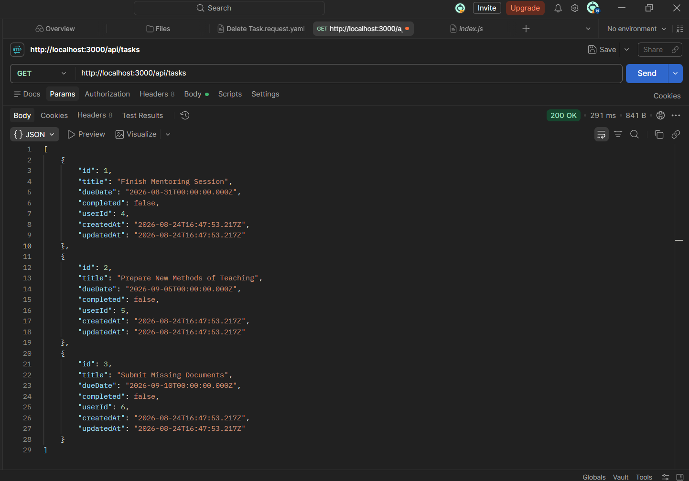
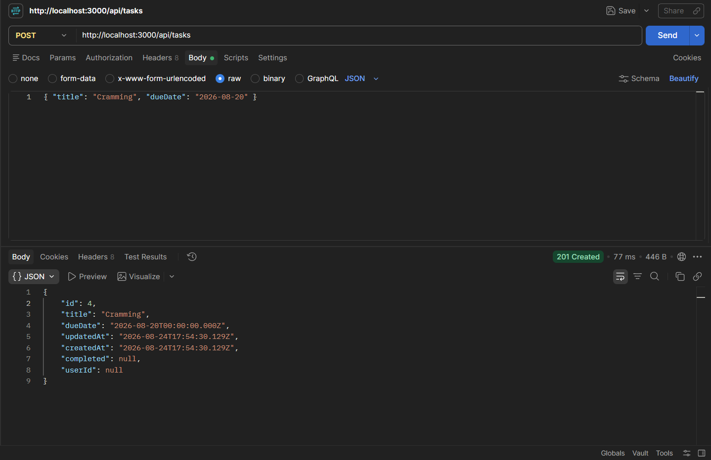
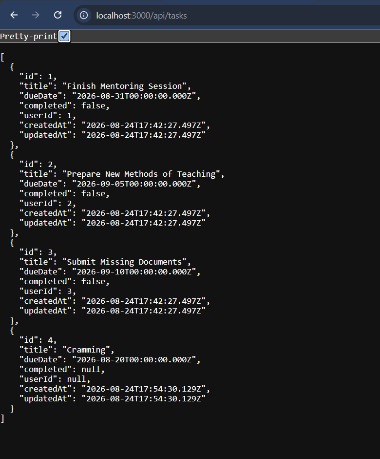
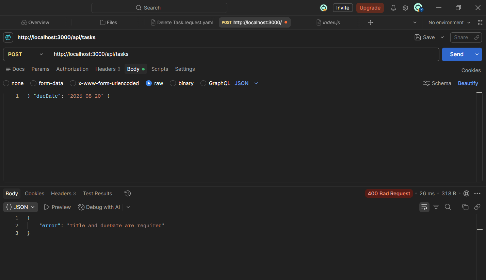
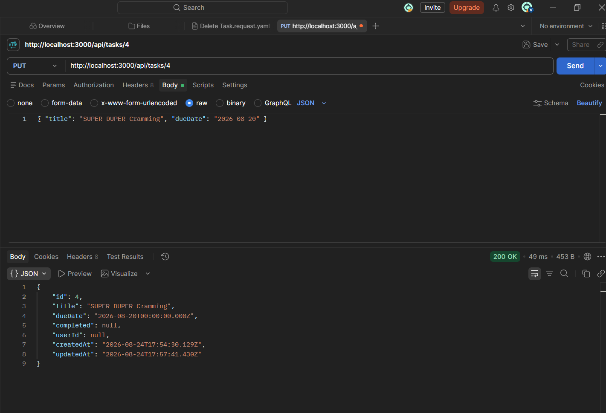
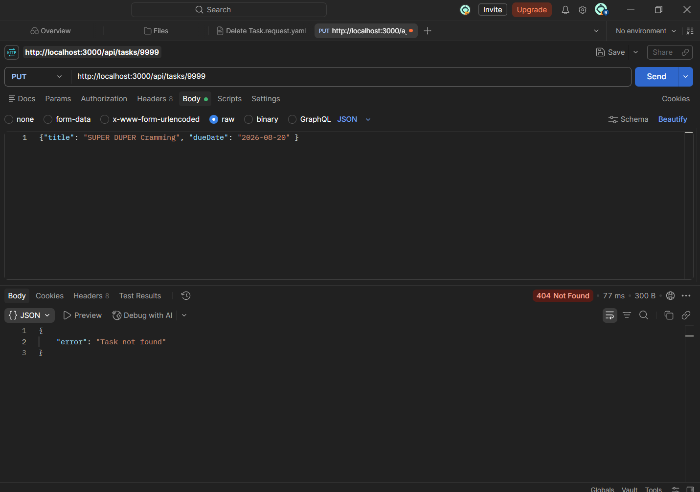
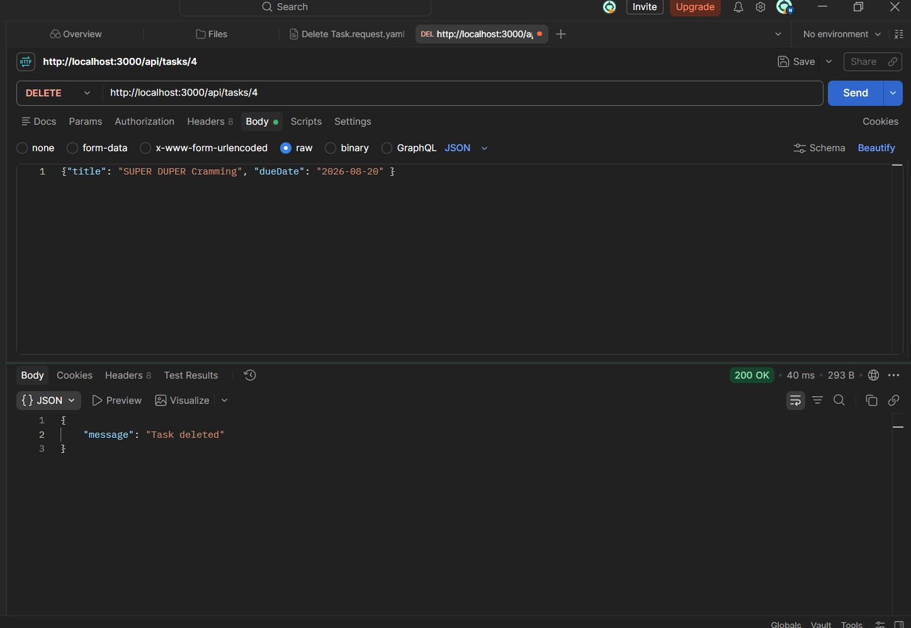
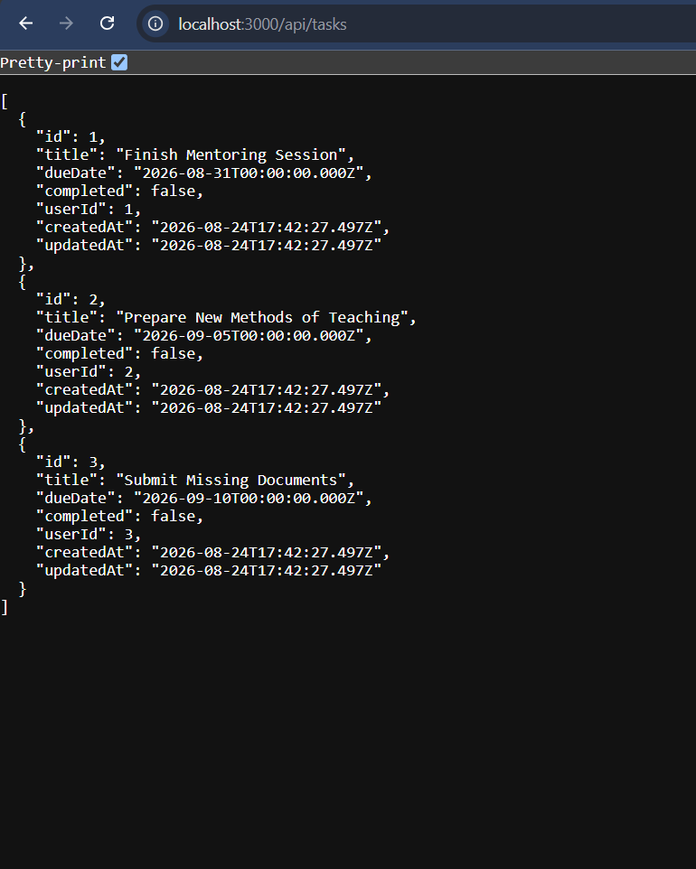
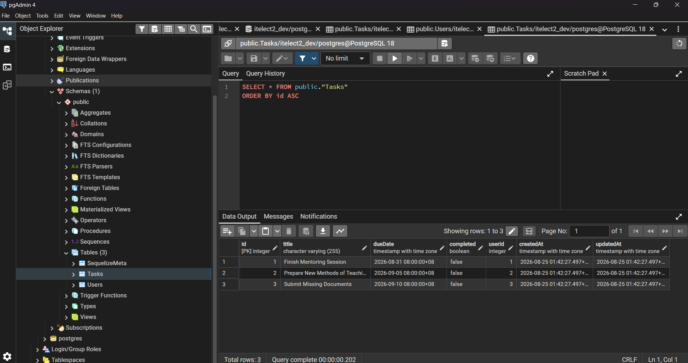
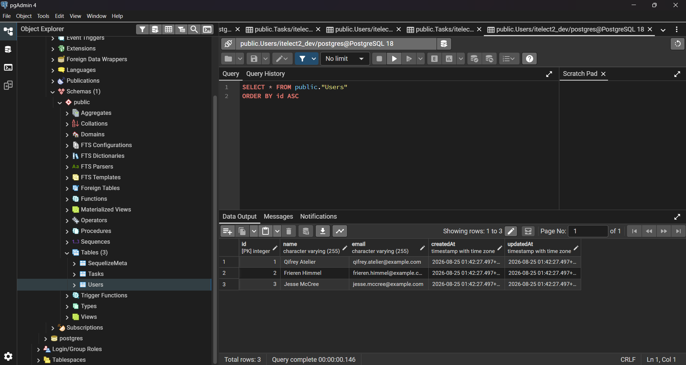

# itelect2-project
My IT Elective 2 backend web development project.

by: Nigel Andrei D. Linatoc - for the first semester of SY 2026-2027.

## API Testing

**1. GET**

**2. POST**

**3. PUT**

**4. DELETE**

## PGADMIN Tables
**TASKS**

**USERS**
